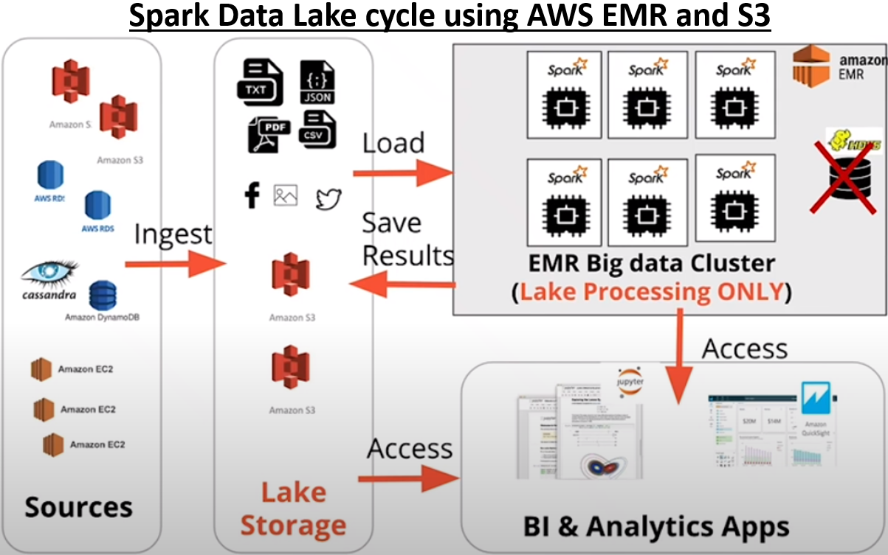
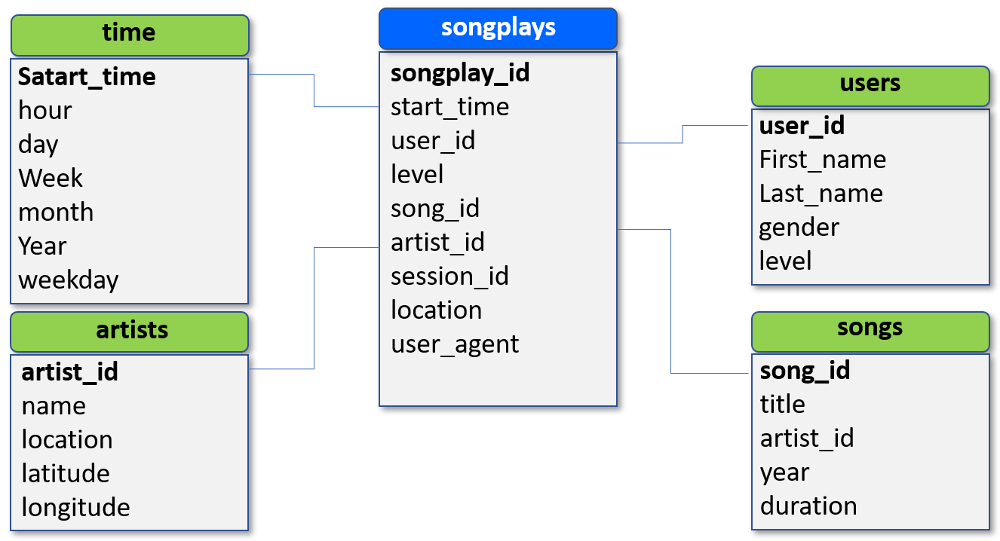

# Spark Data Lake
### Project description
A music streaming company called Sparkify has grown their user base and song database and want to move their data from a data warehouse to a data lake.
The raw metadata resides on S3 as raw JSON files. As a data engineer, I build an ETL pipeline that extracts their data from S3, processes them using Spark, and loads the data back into S3 as a set of dimensional tables. This will allow their analytics team to continue finding insights in what songs their users are listening to.

*Spark Data Lake Option using AWS EMR and S3. HDFS not used, all data stored in S3. Data is loaded to EMR for processing, and saved back to S3.*
*Figure from Udacity lecture notes.*

### Song JSON data
The first dataset is a subset of real data from the [Million Song Dataset](http://millionsongdataset.com/).  
Each JSON file has metadata for a particular track, with the following fields:
- *num_songs, artist_id, artist_latitude, artist_longitude, artist_location, artist_name, song_id, title, duration, year*

### Log JSON data  
The second dataset is user songplay log files in JSON format generated by this [event simulator](https://github.com/Interana/eventsim). 
These simulate activity logs from a music streaming app based on specified configurations.  
Below is an example of what the data in 2018-11-12-events.json looks like:  

## Datasets
#### Song Dataset
This dataset is a subset of real data from the [Million Song Dataset].  
Each JSON file has metadata for a particular track, with the following fields:
- *num_songs, artist_id, artist_latitude, artist_longitude, artist_location, artist_name, song_id, title, duration, year*

#### Log Dataset
This dataset is user songplay log files in JSON format generated by this [event simulator]. These simulate activity logs from a music streaming app based on specified configurations.  
Below is an example of what the data in 2018-11-12-events.json looks like:  
 
## Database Schema
This image shows the relational properties of the tables. It is a typical STAR schema, with the fact table (songplays) and dimension tables (songs, users, artists, and time).It is denormalized and optimized for simplified queries on song play analysis. 

### Instructions
* **etl.py**: The script reads song_data and load_data from S3, transforms them to create tables, and writes them to partitioned parquet files in table directories on S3.
* **dl.cfg**: Contains credentials for accessing S3.
* **data**: A sample of song_data and log_data saved locally for testing before going to S3.
* **spark-warehouse**: Output tables written to parquet files. Each table has its own directory. 
    * artist table files
    * users table files
    * songs table files 
    * time table files 
    * songplays table
